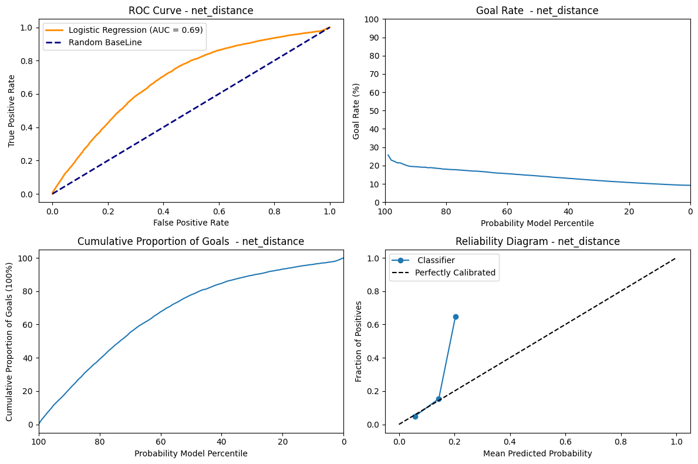
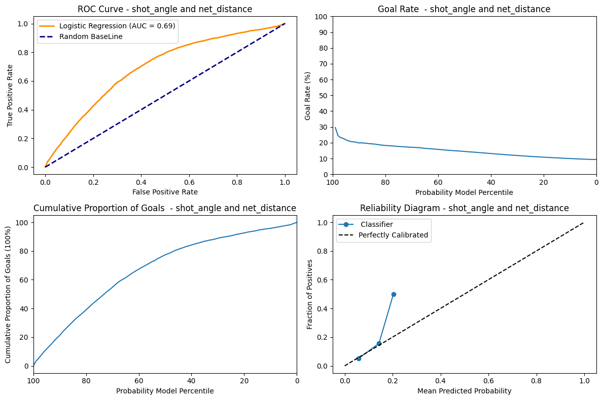
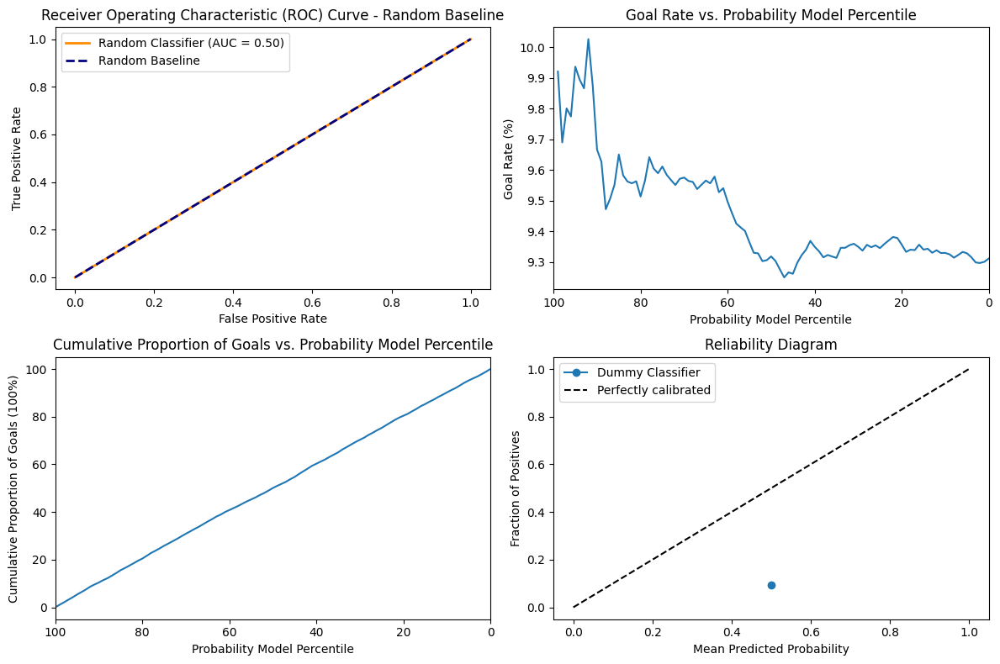

## 2. Feature engineering I
### A histogram of shot counts binned by distance

The shots are consistently more frequent around the offensive zone and the goals are higher closer to the goal and steadily decrease, showing that shots taken closer to the net have a higher success rate.

### A histogram of shot counts binned by angle

The distribution appears to be symmetric around the 0 degrees angle. There are prominent peaks near the center, which correspond to shots taken from directly in front of the net. The high number of shots and goals in this area suggests that straight-on shots are more common and successful.

### A 2D histogram where one axis is the distance and the other is the angle.

There is a sparse distribution of shots at greater distances, indicating that shots are less frequently taken from far away. As the distance from the net increases, the spread of angles from which shots are taken appears to decrease. This suggests that long-distance shots are less likely to be taken from wide angle.

### A histogram of average goal rate vs distance bins

Now we have calculated the goal rate which is the efficiency of goal scoring attempts. As seen from the bar plot we can see that the efficiency is more at the distance [0-20] since it's near the goal post. The interesting thing is that the efficiency increases at higher distances. Even though there were less shots in higher distance, the efficiency of scoring a goal is better than distances in the middle. Since this is counter-intuitive, it might be a sign that there was some mistake either in data processing or in the entry of data and these shots were actually taken from the offensive zone and simply mislabelled which would render our distance calculation wrong.

### A histogram of average goal rate vs angle bins

The goal rate seems to follow a similar trend that of the shot counts with the highest being directly in front of the goal and then it gets lower as the angle becomes more extreme. As discussed the straight-on shots lead to a higer goal rate. 

### A histogram of goals count binned by distance.

A significant majority of goals are scored from a close distance. There are very few goals scored on an empty net. They are spread out over a range of distances, including some from very long range. The non-empty net goals are rarely scored from distances beyond 75 feet, underscoring the difficulty of scoring long-range goals with the presence of goalie.

Regarding to the domain knowledge: “it is incredibly rare to score a non-empty net goal on the opposing team from within your defensive zone”, a histogram of goals from teams'defensive zone is created as below.

The histogram reveals that scoring a non-empty-net goal on the opposing team from the team's defensive zone is indeed a rare event. The distribution suggests that these occurrences are relatively random and are not heavily influenced by the distance from the goal. Additionally, it's noted that some goal data may be recorded incorrectly, with one example is the first goal of game 2018020722 at 04:39, 1st period. The x/y coordinates has been recorded incorrectly to -85 and -22 respectively. For verification and context, game highlights are available through the provided [link](https://www.nhl.com/gamecenter/bos-vs-phi/2019/01/16/2018020722/playbyplay). This could explain why for certain bin distances, there are even more goals with a non-empty net than with an empty net. 

## 3. BaseLine Models

We created a training and validation split and used net_distance from out train dataset to predict binary classification of is_goal in our dataset and calculated the accuracy. The accuracy we were getting was 0.90 which is a good one. But then after looking at the predictions we noticed that most of the values were 0. When we used y_pred.sum(), the result was 0. This lead to the conclusion that the data is imbalanced and the class 0 is overrepresented which leads to a very accurate model. In hockey, it's common knowledge that goals are rarely scored, hence class 0 represents the amount of goals that were missed. Another metric like recall would show that our classifier's performance is overestimated with accuracy alone.

### Logistic Regression Trained on Distance. 

[link](https://www.comet.com/duyhung2201/ift-6758-b03-project/423ac86f42e4421fa6a588f1a0235284?experiment-tab=panels&showOutliers=true&smoothing=0&xAxis=step) to experiment

[link](https://www.comet.com/duyhung2201/model-registry/logisitc_regression_-net_distance/1.23.0?tab=assets) to experiment

ROC Curve: The AUC metrics = 0.69 shows that the model is able to discriminate between the positive and negative instances moderately. 

Goal Rate: This graph shows a decreasing trend which shows that at the percentile decreases the goal rate also decreases. Therefore at the highest predicted probability the goal rate is at it's max. That descent is not very step on the other hand and we can see that whether the model is confident in its prediction or not, the goal rate does not vary that much, which shows its not very discriminating. 

Cummulative Proportion of goal: This graph shows that for the highest probability, the curves is the most steep. As such, the highest proportion of goals is scored when the model is very sure. As the probability decrease, the cumulative number of goals increase, but at a smaller and smaller rate. 

Reliability Diagram: The line follows the "Perfectly Calibrated" untill 0.2 and deviates from it and jumps to 0.7. This might indicate that the model predicted probability is only reliable untill 0.2. We also see that the prediction curve stops very early, which shows that our model is not able to generate probabilities higher than a bit over 20%.  

### Logistic Regression Trained on shot_angle

[link](https://www.comet.com/duyhung2201/ift-6758-b03-project/135ea67112774af49a64e27c219b972c?experiment-tab=panels&showOutliers=true&smoothing=0&xAxis=step)
[link](https://www.comet.com/duyhung2201/model-registry/logisitc_regression_-shot_angle/1.11.0?tab=assets)

ROC Curve: The  AUC metrics = 0.51 indicates that the model is pretty much a random classifier, which has a fifty-fifty chance of guessing the right class. 

Goal Rate: Since the AUC = 0.51 the model is not able to assign high goal rate to highest predicted probability. The goal rate is 5% at percentile 0 and also 5% at 100 percentile and almost remains close to constant of 5% at every percentile. This uniform distribution shows that the prediction of the models has no effect on the goal rate. 

Cummulative Proportion of goal: Since the model is not able to discriminate properly, the cumulative goals shows an almost completely linear and regular ascend as the model probability decreases.

Reliability Diagram: Having only one dot on the "Perfectly Calibrated" tells us that the model does not give us additionnal information. So the angle feature alone is not enough to predict the probability of being a goal or not. 

### Logistic Regression Trained on net_distance and shot_angle. 

[link](https://www.comet.com/duyhung2201/ift-6758-b03-project/c3d0f5cc9085462ea455b3d127b3c55e?experiment-tab=panels&showOutliers=true&smoothing=0&xAxis=step)
[link](https://www.comet.com/duyhung2201/model-registry/logisitc_regression_-shot_angle-net_distance/1.11.0?tab=assets)

As seen from the net_distance the AUC score, goal rate , accumulation of goals and reliability diagram are all similar except the goal rate for this graph starts from 30% and shows a slightly steeper descent. This shows that the shot_angle, even when combined with the net_distance does not perform that much better than net_distance alone using a logistic regression classifier. 

### Using Random Baseline.

[link](https://www.comet.com/duyhung2201/ift-6758-b03-project/78e1833e53fa4a989067cd580382dbef?experiment-tab=params)
[link](https://www.comet.com/duyhung2201/model-registry/random_classifier_/1.31.0?tab=assets)

The AUC score is 0.50 since the model does not have any discriminative power. We can also see that the goal rate is very stationary at the around 9.3 to 10 for all values of percentile. The Accumulation of goal has a very uniform increase and decrease in accumulation of goal and percentile. Since the model is random it is not calibrated at all and simply varies according to chance and our particular distribution.

## 4. Feature engineering II

In the dataset we're working with, each feature provides unique and insightful data regarding the events of NHL games. Here is a breakdown of each feature:

- `game_id`: The unique identifier for each game.
- `event`: Type of event being recorded, such as a 'SHOT' or 'GOAL'.
- `prev_event`: The event that immediately precedes the current event.
- `period`: The period of the game in which the event occurred (1, 2, 3 for regular time, additional for overtime).
- `date_time`: The real-world date and time at which the event happened.
- `period_time`: The time on the game clock when the event occurred.
- `game_seconds`: Total number of seconds elapsed in the game when the event occurred.
- `time_from_pre_event`: The time elapsed since the previous event.
- `prev_team`: The team that made the previous event.
- `team`: The team that is associated with the current event.
- `x_coordinate`: The x-coordinate on the rink where the event occurred.
- `y_coordinate`: The y-coordinate on the rink where the event occurred.
- `prev_x_coordinate`: The x-coordinate of the previous event.
- `prev_y_coordinate`: The y-coordinate of the previous event.
- `shooter_name`: The name of the player who took the shot.
- `goalie_name`: The name of the goalie involved in the event.
- `shot_type`: The type of shot taken (e.g., slap shot, wrist shot).
- `empty_net`: Indicates whether the goal was empty when the shot was taken.
- `strength`: The strength of the team during the event (e.g., even strength, power play).
- `power_play_elapsed_time`: This feature tracks the time elapsed during a team's power play. It resets to zero once the power play ends.
- `friendly_non_goalie_skater`: This feature counts the number of skaters, excluding goalies, for the team currently in control of the puck.
- `opposing_non_goalie_skater`: This feature tallies the number of skaters, excluding goalies, for the team without the puck.
- `attacking_side`: The side of the rink is being targeted in the event.
- `net_x`: The x-coordinate of the net being targeted.
- `net_distance`: The distance of the shooter from the net when the shot was taken.
- `distance_from_prev_distance`: The change in distance from the previous event to the current event.
- `shot_angle`: The angle of the shot relative to the net.
- `is_goal`: Indicates whether the shot resulted in a goal (1 for yes, 0 for no).
- `is_empty_net`: Indicates whether the net was empty when the goal was scored.
- `is_rebound`: Indicates whether the shot was a rebound.
- `change_in_shot_angle`: The change in the shot angle from the previous shot.
- `speed_of_change`: Defined as the distance from the previous event, divided by the time since the previous event.

Each of these features will help us to analyze the game with greater precision and insight.

This is the [link](https://www.comet.com/duyhung2201/ift-6758-b03-project/cbd721d275b147df8e7836a07890bb0a?experiment-tab=assetStorage) to the experiment storing a filtered dataframe for game 2017021065.

## 5. Advanced Models

### Baseline XGBoost classifier

For this step, I used a training, validation split of 80/20. Since we have a large training set, this seemed like a good split to ensure there is sufficient data in both the training (for proper fitting) and validatidation set (so the metrics calculated are representative).
I used a preprocessing function to generate the split even though the features were very simple, because I was going to reuse it for later questions and it made the codebase cleaner.

Just using two features, it looks like the XGBoost model performs slightly better than the LogisticRegression classifier, but the difference is very slim. 
Looking at the first subplot, there is a marginal increase of the ROC from 0.7 to 0.71, thus showing that the model performs slightly better at correctly predicting goals. XGBoost are based on decision forests, but are boosted models with more capacity than Logistic regression, which might explain this difference. The difference will probably be higher as we get more features, because tree-based models are better at dealing with large dimension spaces.
The second and third subplots do not really show an obvious difference between the two classifiers and just looking at the curves do not show a significant difference in the ability of both classifiers to predict goal rate and cumulative goals.
Finally, looking at the calibration plots, we can see that both classifiers perform well until around 0.2 of predicted probability, but higher than that they start to diverge from the calibration plot. In the case of the XGB, the variance does not seem skewed and it both underestimate and overestimate the true probability since there are points on both sides of the calibration line.

[link](https://www.comet.com/duyhung2201/ift-6758-b03-project/1ff8722709a044d2bce04971ac0794c5?experiment-tab=panels&showOutliers=true&smoothing=0&xAxis=wall) to experiment

###  Hyperparameter tuning

For hyperparameter tuning, I decided to use an automatic optimization method to find the best hyperparameters. Since we are interested in the probability of goals and not only the actual prediction, I used log_loss as my metric for optimization since it relates more to probability.
I already had experience working with Optuna, which is a library to perform automatic optimization using a bayesian approach, which helps the model converge faster than simply using GridSearch and gives better results than RandomSearch from my experience.
Since we had to work with comet.ml, I decided to use their own optimization library so I could log my experiment more easily and generate figures related to the optimization process.
This type of library necessitates to have a dictionary of parameters, so I used a list from the official Optuna github with all the usual parameters for an XGBoost classifier. 

Link to dictionary : https://github.com/optuna/optuna-examples/blob/main/xgboost/xgboost_simple.py

This approach had the advantage of being exhaustive and not necessitating too much knowledge about each hyperparameter.

[link](https://www.comet.com/duyhung2201/ift-6758-b03-project/7834bc1dc7d845e5bd055797faf70a2c?experiment-tab=params) to best experiment

The XGBoost model has a lot of hyperparameters and choosing the best option is complex, because the choice of one hyperparameter influences the others. For instance, both alpha and lambda are a form of regularization, so if one of them is already high, the other can be lower and vice-versa. If the model is properly regularized, we can train for a long time without overfitting, but if the regularization parameters are low, the model might overfit with a large number of epochs. 
The following figure shows all the different combinations used during this optimization. The difficult is complex and hard to interpret, but its simply here to show that modifying one hyperparameter at a time is not enough, since we can see that every line zigzags up and down and even though one hyperparameter choice might seem like it lowers the accuracy, when combined with another hyperparameter it ends up being an advantageous choice.

The following figure was created by using a custom report available on comet.ml to see the impact of each hyperparameter on the log_loss metric by using Spearman correlation.
The most important hyperparameter is eta which corresponds to the learning rate. This make sense intuitively, because if the learning rate is too high, the model will never converge and instead jump back and forth.

Finally, to further prove how complex hyperparameter tuning would be without using an agnostic approach like hyperparameter optimization, we can see below some of the hyperparameters for the 3 experiments with the lowest logloss.
Even though their logloss is very similar, they all have various combinations of hyperparameter that sometimes vary widely.

With the hyperparameter optimization, the model was able to improve significantly. Comparing the model with the baseline, we can see below that its performance as a classifier has improved significantly, witht he AUC now being 76% as compared to 71% on baseline. 
Looking at the Goal rate, we can see that when the probability model percentile is very high it is now associated with a much higher goal rate with the line going a bit over 45 as compared with 27.5 around the 99th percentile. This shows that the model is better at detecting high probabilities and that is also reflected in the calibration plot. The cumulative proportion of goals still has a very similar curve that is hard to distinguish between models.

### Feature selection
For feature selection, I decided to use a sequential approach by using progressively more complex techniques. There are some automated feature selection tools available with the sci-kit learn library that can choose feature either based on their importance or on their impact on a predefined metric.
To do so they can test sequential removal or adding of features and see how it affects the intended metric. Having used Recursive Feature Elimination with Cross Validation in the past, I knew that the runtime would be very long if I did not try to at least remove some features before.
I first looked at highly correlated features, using an arbitrary threshold of 0.80. Highly correlated features do not add more information in combination than any of them alone and they tend to make models, especially linear ones unstable. With that, I was able to remove two features.

After that, I looked into feature selection by feature importance. To do so, I made sure to add a standard scaler in my preprocessing steps, even though it is not a necessary steps in the training of an XGBoost model, to make sure the values were comparable. 
Looking at the graph below, we can see that some features were not used at all in the construction of the XGBoost like prev_event_goal and prev_event_penalty. I guess that after a goal has just been scored, since the plays are restarted it does not correlate with the chances of having another goal.
Interestingly, the most important feature is one we calculated in the first part, net_distance which is very intuitive. The time from prev_event too, since if the events are very close, it means the game is very active, there are a lot of passes or shots and a higher chance to score. 

With this method, I ended up with around 15 features, which I thought was a big cut from the original features. Since XGBoost perform well even in high dimensionality, I wanted to make sure using another technique based on performance this time that I was not removing too many useful information.
I decided to use sequential feature selection by using a backward approach, to try and ensure to keep as many features as possible. This ended up necessitating a runtime of more than 3 hours on my computer and in the future, we will probably spend more time on manual removal before using this type of method.
Interestingly, even this greedier approach ended up selecting only 16 features out of the 31 (including every onehot encoded categories). A lot of the features were the same and only 6 differed between both sets. 
I ended up going with the features selected by score, because I thought the small difference still made a difference on the estimator score. 

After choosing the final subset of features, I tried to run an hyperparameter optimization again, but looking at cross-validation scores, the original hyperparameters on which feature selection was based performed slightly better, so I ended up keeping that combination of hyperparameter and features. 
[Link](https://www.comet.com/duyhung2201/ift-6758-b03-project/bd37efe04d73402e8fb92e99dce2b994?experiment-tab=panels&showOutliers=true&smoothing=0&xAxis=wall) to best experiment.

Comparing these results with the baseline XGB, we can first see a small increase in the accuracy as shown in the ROC that is slightly higher with an area under curve of 0.72 instead of 0.71 now.
The curves for cumulative goals and goals rate are similar, but the model nows predicts a slightly higher goal rate when it is very confident. I do not see a meaningful difference for the cumulative goals.
Interestingly, without feature selection, the XGBoost model performed very well with an AUC-ROC of 76% and a calibration plot that was almost perfect. The problem might be due to overfitting, but since we used a validation set, it will be interesting to see the results on the test set.
Finally, looking at the calibration plot, we can see that the XGBoost is now very precise until around 50% of predicted probability, but after that the model is not able to be confident enough in its prediction, which might be due to loss of relevant informations.

## 6. Best Shot
In this part of the project, we tried playing with the Feature Engineering part coupled with New Algorithms to see if we can improve the performance of the model. 

### Various Feature Engineering Techniques and Classification Algorithms
We first used `Lable Encoders` for the Categorical features in this complied with the `StandardScaler` to scale thing normally. Moreover, instead of removing the whole rows of the Data with some missing values, we tried to populate it with the use of `Interpolation`. This significantly increased our accuracy on the simplest Classification Alogrithms like `Decision Tree` and `Random Forest`. We also tried to use the `Squential Model(Neural Nets)` to check if there is any specific advantages.

Here are some Graphs for the `Decision Tree`, `Random Forest` and `Sequential Model` to demonstrate the performance of the model.:



 
 
 
 
 
 

We can see the KNN Model performed the least when comapred to other models. The Decision Tree and Random Forest and Sequential Model performed fairly equally but considering the Simplicity of the **Decision Tree** we choose it to be our **best model**.

## 7. Evaluate on test set

### Comparision of Models on Regular and Playoff Dataset
 



As seen from the above graphs most of the models performed similar to the validation set.

The ROC curve remains consistent for the Regular and Playoff dataset. This shows that the model is able to discriminate between the positive and negative instances noramlly.

So, conclusivly we can say that the model is generalizable well on the test set, since the performance is similar to the validation set and the ROC curve is consistent for both the datasets. Though an clear exception to the Reliability Curve is the XGBoost model which is not able to predict the probability of the goal properly on the Regualr Dataset but does fine on Playoff Dataset. 
